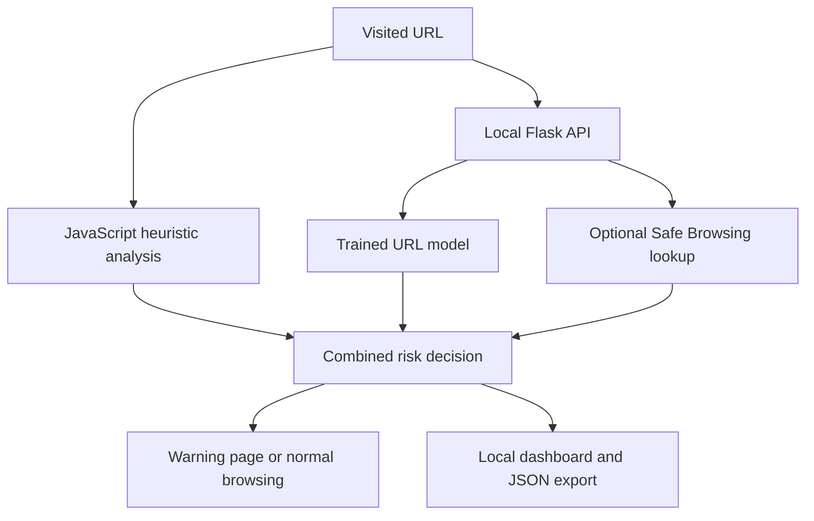

# Malicious URL Detector

A Chrome extension that analyzes visited URLs using browser-side heuristics, a trained phishing URL classifier, and optional threat intelligence. High-risk URLs are redirected to a warning page, and recent detection events are available in a local dashboard.

This project focuses on explaining **how a detection decision was made**, evaluating classification errors, and documenting the limits of URL-only analysis.

## Features

- Monitors main-frame HTTP and HTTPS navigations
- Extracts URL indicators such as length, IP-based hosts, suspicious words, encoded characters, and unusual structure
- Uses a locally trained logistic regression model to estimate phishing risk
- Combines heuristic and model results into one final risk score
- Optionally checks public URLs with Google Safe Browsing v5
- Redirects high-risk tabs to a warning page
- Supports an exact-hostname trusted-site list
- Stores the 50 most recent scan events in Chrome local storage
- Displays recent detections and exports them as JSON

## Architecture



The Chrome extension communicates only with a Flask API running on `127.0.0.1:5000`. The backend parses URL strings for model inference; it does not visit the submitted websites.

## Risk decision

The extension assigns a heuristic score from 0 to 100. When the trained model is available, the final score is:

```text
final score = round(0.6 × heuristic score + 0.4 × model probability)
```

The model probability is expressed on a 0–100 scale for this calculation.

| Final score | Classification | Action |
| ---: | --- | --- |
| 0–39 | Safe | Record the scan |
| 40–69 | Suspicious | Record the scan |
| 70–100 | High Risk | Redirect to the warning page and record the scan |

A Google Safe Browsing threat match sets the final score to 100. If the Flask backend is unavailable, the extension falls back to the heuristic score.

The `60:40` weighting and the 70-point redirect threshold are initial design choices. They have not been calibrated against recent real-world browsing traffic.

## Machine learning model

The backend extracts 17 lexical features from each URL, including:

- URL and hostname length
- Dot, hyphen, and digit counts
- Subdomain count and IP-address usage
- HTTP usage and `@` characters
- Percent-encoded characters
- Path and query length
- Punycode indicators
- Suspicious words and character entropy

The training pipeline uses scikit-learn's `StandardScaler` and `LogisticRegression`. It exports the learned coefficients to `backend/model.json`. The Flask backend reads this numeric JSON file for inference rather than loading a pickle file.

The model is trained to distinguish **phishing** from **legitimate** URLs. It is not separately trained to identify malware distribution URLs.

### Dataset and attribution

The model was trained using the `URL dataset.csv` file from:

> Kaitholikkal, J. K. S., and Arthi B. (2024). *Phishing URL dataset*. Mendeley Data, Version 1. https://doi.org/10.17632/vfszbj9b36.1

Dataset license: [CC BY 4.0](https://creativecommons.org/licenses/by/4.0/).

The original dataset has 450,176 labeled URLs. After validation and duplicate removal, 450,128 distinct valid URLs were used. The source CSV is not included in this repository. `training/prepare_mendeley.py` verifies its SHA-256 hash and converts the source `type` column to the `label` column expected by the trainer.

### Held-out evaluation

The dataset was split by **hostname**, so an identical hostname does not appear in both the training and test partitions. The model was trained on 367,505 URLs and evaluated on 82,623 held-out URLs.

| Metric | Result |
| --- | ---: |
| Precision | 99.57% |
| Recall | 97.10% |
| F1 score | 98.32% |
| False positive rate | 0.132% |
| False negative rate | 2.90% |
| True negatives | 62,879 |
| False positives | 83 |
| False negatives | 570 |
| True positives | 19,091 |

These are **model-only results** using a 0.5 classification threshold. They are not measurements of the complete browser extension or its 70-point redirect rule.

The legitimate and phishing URLs came from different historical sources. Source-specific patterns and changes in attacker behavior can make these results optimistic for current browsing traffic. `training/metrics.json` contains the dataset hash, split description, and exact evaluation results.

## Project structure

```text
malicious-url-detector/
├── frontend/
│   ├── manifest.json
│   ├── background.js
│   ├── detector.js
│   ├── decision.js
│   ├── popup.html
│   ├── popup.js
│   ├── warning.html
│   ├── warning.js
│   ├── dashboard.html
│   ├── dashboard.js
│   └── styles.css
├── backend/
│   ├── app.py
│   ├── features.py
│   ├── predictor.py
│   ├── threat_intel.py
│   └── model.json
├── training/
│   ├── prepare_mendeley.py
│   ├── train_model.py
│   └── metrics.json
├── data/
│   └── README.md
├── requirements.txt
└── README.md
```

## Run locally

### 1. Install Python dependencies

Python 3.11 or newer is recommended. From the repository root, run the following commands in Windows PowerShell:

```powershell
python -m venv .venv
.\.venv\Scripts\python.exe -m pip install -r requirements.txt
```

If `.venv` already exists, keep it and run only the `pip install` command.

### 2. Start the local backend

```powershell
.\.venv\Scripts\python.exe backend\app.py
```

The API listens on `http://127.0.0.1:5000`. Keep this terminal open while using the extension.

To check that the trained model is loaded, open a second PowerShell terminal:

```powershell
$body = '{"url":"https://www.google.com"}'
Invoke-RestMethod -Uri "http://127.0.0.1:5000/predict" -Method Post -ContentType "application/json" -Body $body
```

The response should contain a numeric `phishing_probability`, an `ml_label`, and a `threat_intel` status. A threat intelligence status of `disabled` is expected when no API key is configured.

### 3. Load the Chrome extension

1. Open `chrome://extensions`.
2. Enable **Developer mode**.
3. Click **Load unpacked**.
4. Select this repository's **`frontend` folder**.
5. Reload the extension after changing its JavaScript or manifest files.

The extension can still perform heuristic analysis if the Flask backend is stopped. Model prediction and threat intelligence will then be unavailable.

## Reproduce model training

Download **`URL dataset.csv`** from the [Mendeley Data dataset page](https://data.mendeley.com/datasets/vfszbj9b36/1). The separate `Phishing URLs.csv` file contains only phishing examples and is not the training input used here.

If the file is in your Windows Downloads folder:

```powershell
.\.venv\Scripts\python.exe training\prepare_mendeley.py --original "$env:USERPROFILE\Downloads\URL dataset.csv"
```

Then train and evaluate the model:

```powershell
.\.venv\Scripts\python.exe training\train_model.py --data data\urls.csv --source "Kaitholikkal and Arthi B, Mendeley Data V1 (2024), DOI 10.17632/vfszbj9b36.1, CC BY 4.0; downloaded YYYY-MM-DD"
```

Training creates or updates `backend/model.json` and `training/metrics.json`. Restart the Flask server after retraining so it loads the new model.

The downloaded CSV and prepared CSV are excluded from Git by `.gitignore`. The scripts analyze URL strings without opening the websites listed in the dataset.

## Optional threat intelligence

Set `SAFE_BROWSING_API_KEY` before starting Flask to enable Google Safe Browsing v5 URL lookups:

```powershell
$env:SAFE_BROWSING_API_KEY = "YOUR_API_KEY"
.\.venv\Scripts\python.exe backend\app.py
```

Do not put the key in the source code or commit it to GitHub.

With a key configured, the backend sends public URL lookups to Google and caches responses according to the API's returned cache duration. Private IP addresses and local or reserved hostnames are skipped. Without a key, no URL is sent to Google by this feature.

Google describes the Safe Browsing API as intended for noncommercial use. Review its terms before using this integration outside an educational project.

## Manual verification

1. Visit `https://www.google.com` and open the extension popup. Confirm that the model field shows a numeric probability.
2. Open the dashboard and check that a scan event appears.
3. Visit `http://example.com/login-bank-secure-update-password-free-gift` to exercise the high-risk warning flow. This is a synthetic test path on an example domain, not a real phishing URL.
4. Confirm that the warning page displays the risk score and detection reasons.
5. Return to the dashboard and export the recent events as JSON.
6. Stop Flask and open the popup again to verify the heuristic fallback.

## Security and privacy limitations

- Redirection happens **after navigation begins**. This extension does not guarantee that a page is blocked before any content loads.
- Lexical URL analysis cannot inspect page content, redirects, certificates, or a legitimate website that has been compromised.
- Both the heuristic and trained model can produce false positives and false negatives.
- Trusting a hostname overrides the warning for that exact hostname.
- Local scan events contain full URLs, including possible sensitive query parameters. JSON exports contain the same data.
- The dashboard keeps only the 50 most recent scan events; its counters describe those retained events.
- JSON export provides a starting point for future SIEM integration. Automatic Wazuh, Elastic, or Sentinel ingestion is not implemented.